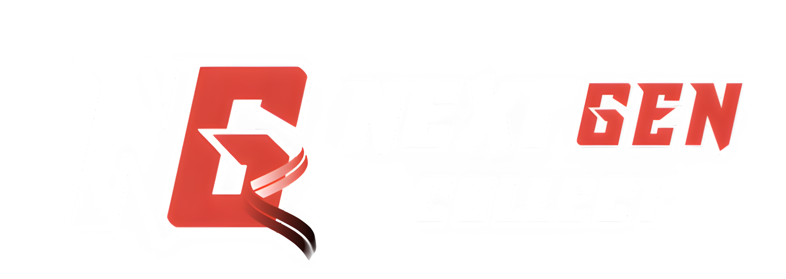

# NextGenCollect

NextGenCollect adalah platform berbasis web yang dibangun dengan **Laravel** yang memungkinkan pengguna untuk **mengelola**, **menampilkan**, dan **memperdagangkan** aset digital dalam bentuk **NFT (Non-Fungible Token)**. Platform ini menawarkan berbagai fitur yang mendukung **komunitas kreatif** dan **kolektor digital**, dengan sistem yang kuat dan **dashboard interaktif** untuk memudahkan analisis, manajemen aset, dan interaksi pengguna.

## Fitur Utama NextGenCollect

### 1. Manajemen Koleksi NFT

-   **Upload dan Kelola NFT**: Seniman dapat mengunggah karya mereka dalam berbagai format seperti gambar, audio, atau video.
-   **Metadata Kustom**: Setiap karya NFT dapat memiliki metadata unik, seperti nama, deskripsi, teknik, tahun pembuatan, dan tema.

### 2. Dashboard Interaktif

-   **Statistik dan Analitik**: Menyediakan grafik real-time untuk **NFT Terjual vs NFT Tersedia**, **Statistik Lelang**, dan **Jumlah NFT**.
-   **Grafik Lelang**: Menampilkan jumlah lelang yang sedang dibuka dan ditutup.
-   **Komentar Pengguna**: Fitur untuk berinteraksi dengan kolektor melalui komentar di setiap karya.

### 3. Sistem Pelelangan

-   **Lelang NFT**: Pengguna dapat membuat lelang untuk karya mereka, dengan pengguna lain menawar dengan harga tertinggi.
-   **Bidding dan Pembayaran**: Pembayaran dilakukan melalui **Midtrans** untuk transaksi yang aman.

### 4. Komunitas dan Umpan Balik

-   **Komentar Pengguna**: Pengguna dapat memberikan komentar terkait karya NFT, dan komentar tersebut akan dilihat oleh pemilik karya.

### 5. Manajemen Pengguna dan Peran

-   **Role-based Access**: Platform ini memungkinkan pengelolaan pengguna dengan peran yang berbeda. Misalnya, peran **Seniman**, **Kolektor**, dan **Admin**, masing-masing dengan akses dan kontrol yang berbeda.
-   **Manajemen Pengguna**: Admin dapat mengelola daftar pengguna, mengubah peran, dan status pengguna.

### 6. Integrasi Pembayaran

-   **Pembayaran dengan Midtrans**: Semua transaksi untuk NFT atau lelang dilakukan melalui **Midtrans**, memberikan opsi pembayaran yang aman dan cepat.
-   **Royalti untuk Seniman**: Seniman mendapatkan royalti setiap kali karya mereka dijual kembali di pasar sekunder.

### 7. Pengaturan Aplikasi

-   **Pengaturan Tim**: Admin dapat mengelola data tim, termasuk nama tim, deskripsi, dan foto tim.
-   **Pengaturan Menu dan Submenu**: Fitur untuk mengelola menu dan submenu bagi navigasi platform yang lebih baik.

### 8. Fitur Lainnya

-   **Karya Eksklusif dan Edisi Terbatas**: Seniman dapat memilih untuk membuat NFT dengan edisi terbatas.
-   **Pengaturan Aplikasi dan Keamanan**: Admin dapat mengatur berbagai preferensi aplikasi dan kebijakan keamanan platform.
-   **User Verification**: Proses verifikasi pengguna untuk memastikan bahwa hanya pengguna terverifikasi yang dapat mengunggah dan menjual karya di platform.

---

## Fitur-Fitur Berdasarkan Controller

Berikut adalah daftar lengkap fitur yang terintegrasi dengan **18 controller** dalam sistem NextGenCollect:

1. **Application Setting**: Mengelola pengaturan aplikasi, termasuk tim dan pengaturan umum lainnya.
2. **Checkout Controller**: Mengelola transaksi dan pembayaran untuk pembelian NFT dan karya digital.
3. **Dashboard Controller**: Menyediakan data analitik, statistik, dan pengelolaan dashboard untuk admin dan pengguna.
4. **Kategori Controller**: Mengelola kategori NFT yang diunggah di platform.
5. **Lelang Controller**: Menyediakan sistem lelang untuk NFT, termasuk penciptaan lelang dan penawaran.
6. **Keranjang Controller**: Mengelola keranjang belanja pengguna untuk membeli NFT.
7. **Komentar Controller**: Mengelola komentar dari pengguna terkait karya NFT yang ada di platform.
8. **Menu Controller**: Mengelola menu navigasi untuk aplikasi admin dan frontend.
9. **Nft Controller**: Mengelola upload, update, dan penghapusan NFT dari pengguna.
10. **NftUser Controller**: Menampilkan NFT yang dimiliki oleh pengguna serta fitur terkait.
11. **Penawaran Lelang Controller**: Mengelola penawaran yang dilakukan pada lelang NFT.
12. **Role Controller**: Mengelola peran pengguna (seperti Admin, Seniman, Kolektor) dalam platform.
13. **Setting Menu Controller**: Mengelola pengaturan menu navigasi bagi pengguna platform.
14. **Setting Submenu Controller**: Mengelola submenu dalam sistem navigasi aplikasi.
15. **Submenu Controller**: Mengelola submenu dalam platform.
16. **User Controller**: Mengelola pengguna, termasuk pembaruan profil dan pengaturan pengguna.
17. **Userpage Controller**: Mengelola tampilan halaman pengguna, termasuk komentar dan daftar NFT.
18. **User Verifikasi Controller**: Menangani verifikasi pengguna, seperti verifikasi dokumen dan status pengguna.
19. **Login Controller**: Menangani agar pengguna, bisa masuk dan memperjual belikan nft dan bisa membeli nft nya

---

## Kontribusi

Kami sangat menyambut kontribusi dari komunitas untuk mengembangkan **NextGenCollect** lebih lanjut. Anda dapat berkontribusi dengan memperbaiki bug, menambahkan fitur baru, atau meningkatkan performa sistem. Silakan mengacu pada [panduan kontribusi Laravel](https://laravel.com/docs/contributions) untuk memulai.

---

## Keamanan

Jika Anda menemukan masalah atau kerentanannya di dalam **NextGenCollect**, harap kirimkan laporan secara pribadi melalui e-mail kepada tim pengembangan. Kami berkomitmen untuk segera menangani setiap masalah keamanan yang dilaporkan.

---

## Lisensi

**NextGenCollect** adalah perangkat lunak open-source yang dilisensikan di bawah [MIT license](https://opensource.org/licenses/MIT).

---

## Dokumentasi

-   **Laporan Kinerja Tim**: [Link ke laporan](https://docs.google.com/document/d/1ubQxztUjDL01j7VQo7ZyeAz0gOldz3H8AP2fOYGDQKI/edit?usp=sharing)
-   # **UI Wireframe**: [Figma Design](https://www.figma.com/design/DrsKr2reDDyiaIhqzRHgBm/PWBF?node-id=0-1&p=f&t=sKoYEcibjvtgmnXn-0)
-   **Laporan Kinerja Tim**: [Link ke laporan](https://docs.google.com/document/d/1ubQxztUjDL01j7VQo7ZyeAz0gOldz3H8AP2fOYGDQKI/edit?usp=sharing)
-   **UI Wireframe**: [Figma Design](https://www.figma.com/design/DrsKr2reDDyiaIhqzRHgBm/PWBF?node-id=0-1&p=f&t=sKoYEcibjvtgmnXn-0)
